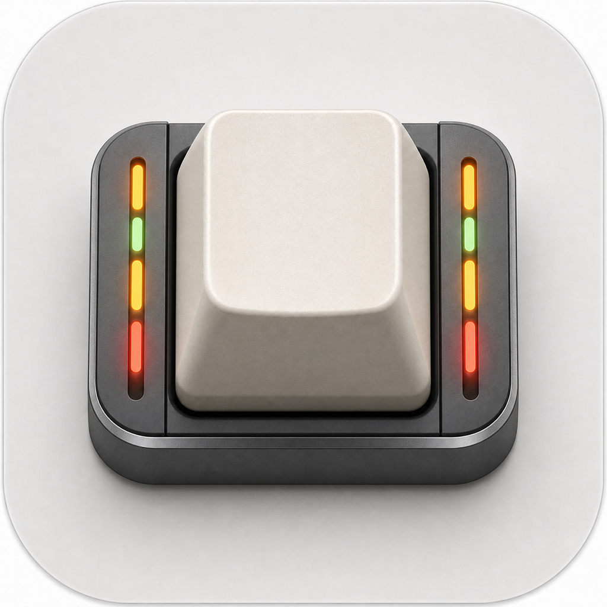
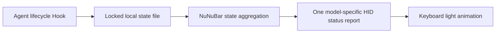

<p align="center">
  
</p>

<h1 align="center">NuNuBar</h1>

<p align="center">Show local AI agent status on a NuPhy keyboard's side lights.</p>

<p align="center">
  <a href="START_HERE.md">Start here</a> ·
  <a href="README.zh-CN.md">简体中文</a> ·
  <a href="../../releases/latest">Downloads</a> ·
  <a href="docs/CODEX_SETUP.md">Set up with Codex</a>
  · <a href="docs/CODEX_MICRO_MODE.md">Codex Micro mode</a>
</p>

NuNuBar turns Codex and other local agent lifecycle events into keyboard light
states. The host sends a small control packet only when state changes; the
keyboard renders the color and animation locally. NuNuBar does not read
keystrokes, prompts, or responses.

## Give this repository to Codex

Send this repository URL and the following request to Codex on the new user's
computer:

```text
Configure NuNuBar by following START_HERE.md. Read AGENTS.md and the linked
documents, run python3 script/preflight.py --json, and combine its report with
my physical confirmation before selecting a route. Explain and obtain separate
approval for App installation, Hook changes, entering DFU, and firmware flash.
```

Codex runs a read-only preflight and selects exactly one of the three verified
macOS paths below. It must stop on every other host or keyboard, and must not
infer a firmware model, approve Hook trust, enter DFU for the user, or flash
without a separate confirmation.

The canonical prompt and shortest user handoff are in
[START_HERE.md](START_HERE.md). For the full flow, see
[Codex setup](docs/CODEX_SETUP.md). The read-only preflight never installs
software, edits Hooks, or flashes firmware.

## Start with a proven path

NuNuBar has three hardware-verified normal-user paths:

1. Air65 V3 on Apple Silicon macOS over wired USB, using the official interface
   without a firmware flash. Codex status lighting and the optional right-knob
   task switch are physically verified.
2. Air75 V3 on Apple Silicon macOS over wired USB, using official firmware
   `1.0.14.6` or later. NuNuBar detects older firmware and stops for a separately
   approved NuPhyIO backup and official update.
3. Air96 V2 ANSI on Apple Silicon macOS over wired USB. Existing firmware is
   tested first; the verified v7 firmware path is used only when that self-test
   fails.

See [Verified setup paths](docs/VERIFIED_PATHS.md) for the decision matrix,
exact model procedures, success checklist, and troubleshooting evidence.

## Platform support

| Host | Client | Transport | Normal-user status |
|---|---|---|---|
| macOS 14+, Apple Silicon | Native menu-bar app and guided setup | Wired Air65/Air75 V3 official HID or Air96 V2 Raw HID | Hardware verified |

Windows and Intel Mac code may remain in the repository for contributors, but
neither is a hardware-verified normal-user path.

## Keyboard support

The normal-user flow supports only these exact models:

| Model | USB VID:PID | Light area | Current USB firmware |
|---|---|---|---|
| Air65 V3 | `19F5:102B` | Side lights | Official firmware, no flash; automatic profile discovery, default orange/green/red, real Codex transitions, and `F23` right-knob task switching verified |
| Air75 V3 | `19F5:1028` | Side lights | Official firmware `1.0.14.6` or later; official cyan test, NuNuBar states, and real Codex working-to-complete transition physically verified |
| Air96 V2 ANSI | `19F5:3266` | Both side bars | Verified v7 path; self-test existing firmware before any flash |

Air65 V3 uses the official firmware's 64-byte wired control interface. It does
not enter DFU or modify keyboard firmware. Bluetooth remains available for
ordinary typing, but Air65 V3 status lighting currently requires wired USB. See the
[Air65 V3 verification record](docs/AIR65_V3_VERIFICATION.md) for exact hardware evidence and pending checks.
Air75 V3 uses the same class of official 64-byte wired interface with a
model-specific `D6` side-light layout and a minimum official firmware version.
See the [Air75 V3 verification record](docs/AIR75_V3_VERIFICATION.md).
Users who want an always-on idle color must disable the keyboard's own Auto-sleep
with a short `Fn + ]` press, then select a non-black solid idle color in NuNuBar.
This official firmware control does not require HID polling.
On macOS, the model-specific mapping editors for
[Air65 V3](docs/AIR65_V3_KEY_MAPPING.md) and
[Air75 V3](docs/AIR75_V3_KEY_MAPPING.md) create exact-device System and Codex
actions from clickable physical layouts. Both expose independent NuPhyIO
`F21`/`F22`/`F23` knob carriers. The previously verified Air65 yellow `PGDN`
to Fn/Globe route remains supported without migration.

> [!NOTE]
> Status-light synchronization does **not** require Karabiner. Air65/Air75 V3
> key and knob mapping currently requires official Karabiner-Elements for macOS.
> NuNuBar detects it and, only after confirmation, merges exact-device rules
> into the user's Karabiner configuration. Without Karabiner, lighting still
> works but these shortcut mappings do not.

The exact Air96 prerequisites, v7 hash, confirmation gates, and acceptance list
are in [Air96 V2 verified setup](docs/AIR96_V2_SUCCESS.md).

Air60 V2, Air75 V2, Halo75 V2, Windows, and other families remain contributor
or test assets. They are not offered by the normal-user flow, and similar names
or lighting zones do not imply compatibility.

> [!IMPORTANT]
> Firmware images are model-specific and cannot be interchanged. Back up VIA,
> keep the exact official recovery image, verify the bundled SHA-256, and use a
> stable USB connection. The verified Air96 v7 image is never offered until the
> existing-firmware self-test has failed.

## Default light states

| Agent state | Default color | Default effect | Default duration |
|---|---|---|---|
| Idle | Off `#000000` | Solid | Until the next task |
| Working | Orange `#FC5400` | Breathe | Event-driven; 15-minute stale timeout |
| Waiting | Red `#FF0000` | Blink | Event-driven; 15-minute stale timeout |
| Error | Red `#FF0000` | Blink | 15 seconds |
| Complete | Green `#00FF00` | Solid | 15 seconds |

On USB firmware v3, each state can use a custom RGB color and one of solid,
breathe, or blink. Air65/Air75 V3 official firmware supports solid and breathe;
NuNuBar renders blink with 500 ms on/off frames and validates the keyboard ACK
for every frame. The macOS app exposes these controls in its Light settings,
along with completion/error durations and independent working/waiting stale
timeouts. Changes are stored locally and take effect immediately.
All verified paths currently use USB. Bluetooth is not a verified status-light
transport.

## How it works



Priority is `error/waiting > working > complete > idle`, so one completed task
does not hide another task that is still active. Completion and error expire
after their configured display intervals. The app normally sends only state
changes; Air65 V3 blink is the sole host-rendered 500 ms frame exception.

Air96 V2 uses the documented 32-byte `NBAR` Raw HID protocol on usage `FF60:61`.
Protocol v3 carries status, RGB, effect, and checksum. On macOS, Air65 V3 uses
the official 64-byte handshake and control
protocol on usage `1:0`, strictly scoped to `19F5:102B`. The app owns the
session and reads the active light profile before sending status; Hooks update
local state and never open the keyboard directly. Device inspection is read-only
and cannot invalidate the running app's session. See
[NBAR protocol](docs/NBAR_PROTOCOL.md).

## Install without Codex

### macOS

1. Download the Apple Silicon DMG from [Releases](../../releases/latest).
2. Move `NuNuBar.app` to Applications and open it.
3. Grant Input Monitoring when macOS requests it. NuNuBar only writes HID output.
4. Follow the Keyboard assistant, then connect Codex from the Agent settings.
5. In pending Hooks under Codex Settings, approve the four commands whose path
   ends in `NuNuBar.app/Contents/Helpers/agent-light`.
6. Return to NuNuBar, click Check Again, and verify a real Codex task after the
   App reports Connected.

Do not type `/hooks` into a Codex chat. See the complete
[Codex Hook steps](docs/CODEX_SETUP.md#codex-hook-steps) for file and approval
details.

Public builds must be signed with Developer ID and notarized. Locally produced
ad-hoc builds may require Control-click > Open or approval in Privacy & Security.

### Other platforms

There is no hardware-verified Windows or Intel Mac normal-user setup yet.
Contributor implementations remain in the repository but are not selected by
`setupPlan`.

## Build and test

macOS requires the Swift 6.1 toolchain:

```bash
swift test
swift build -c release
./script/package_release.sh
```

With Air65 V3 in wired mode, these hardware diagnostics never enter DFU:

```bash
.build/debug/agent-light demo
.build/debug/agent-light stress 50
.build/debug/agent-light recovery-test 20
.build/debug/agent-light soak-test 300
```

They are contributor diagnostics and intentionally open their own Air65 V3
session. Quit NuNuBar before running them. Normal users should use the in-app
Keyboard light self-test; `agent-light describe` remains enumeration-only and
does not replace the App's session.

The following Windows code is retained for contributor development only; it is
not a verified normal-user path:

```powershell
.\windows\build-release.ps1
```

Pure Windows-client logic can also be tested on macOS or Linux:

```bash
PYTHONPATH=windows python3 -m unittest discover -s windows/tests -v
```

Firmware patches, exact artifacts, hashes, and physical-verification status are
recorded under `firmware/<model>/BUILD_RECORD.md`. See
[Contributing](CONTRIBUTING.md) before adding a keyboard port.

## Repository layout

```text
Sources/                 macOS app, shared state logic, HID transport, CLI
Tests/                   Swift tests
windows/                 Windows companion, Win32 HID layer, tests, packaging
firmware/                model-specific GPL firmware patches and build records
docs/                    Codex handoff, NBAR protocol, release and safety guides
script/                  macOS and Windows setup/package scripts
.github/workflows/       cross-platform contributor checks and macOS Release
```

## Privacy, license, and independence

- No keystroke, prompt, or response reading.
- No cloud service, account, analytics SDK, or background telemetry.
- Hooks store only provider, coarse state, local session ID, and timestamp.
- Installers preserve unrelated configuration and refuse unsafe JSON shapes.

Application code and ordinary project tooling are [MIT licensed](LICENSE).
QMK/NuPhy-derived firmware is
[GPL-2.0-or-later](firmware/LICENSE-GPL-2.0-or-later.md). See
[Security](SECURITY.md) and [Third-party notices](THIRD_PARTY_NOTICES.md).

NuNuBar is a community project and is not affiliated with or endorsed by
NuPhy, OpenAI, Anthropic, or any other agent vendor.
