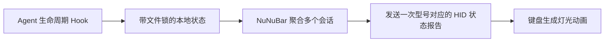

<p align="center">
  
</p>

<h1 align="center">NuNuBar</h1>

<p align="center">让 NuPhy 键盘侧灯显示本机 AI Agent 的工作状态。</p>

<p align="center">
  <a href="START_HERE.md">快速开始</a> ·
  <a href="README.md">English</a> ·
  <a href="../../releases/latest">下载</a> ·
  <a href="docs/CODEX_SETUP.zh-CN.md">交给 Codex 配置</a>
  · <a href="docs/CODEX_MICRO_MODE.zh-CN.md">Codex Micro 模式</a>
</p>

NuNuBar 把 Codex 等本地 Agent 的生命周期事件转换成键盘灯光状态。电脑只在状态
变化时发送很小的控制包，键盘在本地生成颜色和动画。NuNuBar 不读取
按键、提示词或回复内容。

## 把这个仓库交给 Codex

在新用户的电脑上，把仓库链接和下面这段话发给 Codex：

```text
请按照 START_HERE.md 中的流程配置 NuNuBar。先阅读 AGENTS.md 和相关文档，
运行 python3 script/preflight.py --json，再结合我的实体确认选择准确路线。
安装 App、写入 Hooks、进入 DFU 和刷写固件必须分别说明并分别取得我的确认。
```

Codex 会先运行只读预检，只能选择下面两条已验证 macOS 路线之一。其他电脑或
键盘必须停止；不得根据外观猜固件型号，不得代替用户批准 Hook 信任，不得替用户
进入 DFU，也不得在没有单独确认时刷写。

最短的新用户入口和唯一规范提示词见 [START_HERE.md](START_HERE.md)，完整交接
流程见 [Codex 配置指南](docs/CODEX_SETUP.zh-CN.md)。只读预检不会安装软件、
修改 Hooks 或刷写固件。

## 优先使用已成功路线

NuNuBar 当前只有两条实机成功的普通用户路线：

1. Apple Silicon macOS + Air65 V3 + 有线 USB，直接使用官方接口，完全不刷
   固件；Codex 状态灯和可选的右旋任务切换已实机验证。
2. Apple Silicon macOS + Air96 V2 ANSI + 有线 USB；先测试现有固件，只有自检
   失败时才进入已验证的 v7 固件流程。

请先阅读[已验证的成功路径](docs/VERIFIED_PATHS.zh-CN.md)，其中包含按实际环境
选择路线的矩阵、Air65 V3 准确步骤、成功验收清单和故障证据。

## 系统支持

| 系统 | 客户端 | 连接方式 | 普通用户状态 |
|---|---|---|---|
| macOS 14+，Apple Silicon | 原生菜单栏 App 和首次设置向导 | Air65 官方有线 HID 或 Air96 V2 Raw HID | 已实机验证 |

仓库可以继续保留 Windows 和 Intel Mac 的贡献者代码，但它们都不是已实机验证的
普通用户路线。

## 键盘支持

普通用户流程只支持以下两个准确型号：

| 型号 | USB VID:PID | 灯光区域 | 当前 USB 固件状态 |
|---|---|---|---|
| Air65 V3 | `19F5:102B` | 侧灯 | 官方固件直连；自动配置读取、默认橙/绿/红、真实 Codex 切换和 `F23` 右旋任务切换已验证 |
| Air96 V2 ANSI | `19F5:3266` | 左右两侧灯条 | v7 路线已验证；任何刷写前先测试现有固件 |

Air65 V3 通过官方固件的 64 字节有线控制接口工作，不进入 DFU，也不修改键盘固件。
蓝牙仍可用于正常打字，但 Air65 V3 的 Codex 状态灯目前必须使用 USB 有线模式。
实机 ACK、压力与恢复测试记录见 [Air65 V3 验证记录](docs/AIR65_V3_VERIFICATION.md)。
在 macOS 上，可以使用 [Air65 V3 按键映射编辑器](docs/AIR65_V3_KEY_MAPPING.zh-CN.md)
点选键位并创建设备限定的系统或 Codex 动作，也可分别映射 NuPhyIO 的
`F21`/`F22`/`F23` 旋钮输入；此前已验证的黄色 `PGDN` 到 Fn/地球键路线无需迁移，
继续兼容。

> [!NOTE]
> 状态灯同步**不需要** Karabiner。Air65 V3 当前的按键和旋钮映射需要 macOS
> 官方 Karabiner-Elements。NuNuBar 会先检测该组件，并在用户确认后才把准确设备
> 限定规则合并到 Karabiner 配置。没有 Karabiner 时灯光仍然正常，但快捷键映射
> 不会生效。

Air96 的准确材料、v7 哈希、确认节点和验收清单见
[Air96 V2 已验证成功路线](docs/AIR96_V2_SUCCESS.zh-CN.md)。

Air60 V2、Air75 V2、Halo75 V2、Windows 和其他系列只保留贡献者或测试资产，
普通用户流程不会选择它们。名字或灯区相似不代表兼容。

> [!IMPORTANT]
> 每个型号使用独立固件，绝对不能互刷。刷写前必须备份 VIA、准备准确的官方恢复
> 固件、校验 SHA-256，并使用稳定 USB 连接。已验证的 Air96 v7 固件也只有在
> 现有固件自检失败后才能进入刷写流程。

## 默认灯光状态

| Agent 状态 | 默认颜色 | 默认灯效 | 默认时长 |
|---|---|---|---|
| 待机 | 熄灭 `#000000` | 常亮 | 直到下一个任务 |
| 工作中 | 橙色 `#FC5400` | 呼吸 | 跟随事件；15 分钟断联保护 |
| 需要确认 | 红色 `#FF0000` | 闪烁 | 跟随事件；15 分钟断联保护 |
| 错误 | 红色 `#FF0000` | 闪烁 | 15 秒 |
| 完成 | 绿色 `#00FF00` | 常亮 | 15 秒 |

USB v3 固件允许每个状态分别设置 RGB 颜色和常亮、呼吸、闪烁三种灯效。Air65 V3
官方固件支持常亮和呼吸；闪烁由 NuNuBar 通过 500ms 开关帧实现，每帧均校验键盘 ACK。macOS App
可以在“灯光”设置中直接调整颜色、灯效、完成/错误显示秒数，以及工作中/需要确认的
断联保护分钟数；修改会保存在本机并立即生效。当前两条成功路线都使用 USB；
蓝牙不属于已验证的状态灯通道。

## 工作原理



显示优先级为 `错误/等待 > 工作中 > 完成 > 待机`，一个已完成任务不会盖住另一个
仍在工作的任务。完成和错误会按设置的时长过期。应用通常只在状态变化时发送报告；
Air65 V3 闪烁是唯一由 App 每 500ms 发送一帧的例外。

Air96 V2 使用 `FF60:61` Usage 上的 32 字节 `NBAR` Raw HID 协议。v3 报告包含
状态、RGB、灯效和校验值。Air65 V3 在 macOS 上使用官方 `1:0` Usage 的 64 字节握手与控制
协议，并严格锁定 `19F5:102B`。App 建立并持有会话，连接时从键盘读取当前活动
灯光配置后再发送状态；Hooks 只写本地状态，不直接打开键盘。设备检测只读，
不会让正在运行的 App 会话失效。协议详情见
[NBAR 协议](docs/NBAR_PROTOCOL.md)。

## 不使用 Codex 的安装方式

### macOS

1. 从 [Releases](../../releases/latest) 下载 Apple Silicon DMG。
2. 把 `NuNuBar.app` 移到“应用程序”并打开。
3. macOS 提示时允许“输入监控”；NuNuBar 只写 HID 输出，不读取按键。
4. 完成“键盘”向导，再到“Agent”设置中接入 Codex。
5. 在 Codex 设置的 Hooks 待审核项中，批准路径以
   `NuNuBar.app/Contents/Helpers/agent-light` 结尾的四个命令。
6. 回到 NuNuBar 点击“重新检测”，显示“已接入”后再用真实 Codex 任务验收。

不要在 Codex 对话中输入 `/hooks`。完整步骤和配置文件说明见
[Codex Hooks 操作步骤](docs/CODEX_SETUP.zh-CN.md#codex-hooks-操作步骤)。

公开安装包应使用 Developer ID 签名并经过 Apple 公证。本地 ad-hoc 构建可能需要
右键选择“打开”，或在“隐私与安全性”中批准。

### 其他平台

目前没有经过实机验证的 Windows 或 Intel Mac 普通用户路线。仓库中的相关实现
仅供贡献者继续开发，不会由 `setupPlan` 选中。

## 构建与测试

macOS 需要 Swift 6.1 工具链：

```bash
swift test
swift build -c release
./script/package_release.sh
```

Air65 V3 仅在有线模式下运行以下实机诊断，不进入 DFU：

```bash
.build/debug/agent-light demo
.build/debug/agent-light stress 50
.build/debug/agent-light recovery-test 20
.build/debug/agent-light soak-test 300
```

这些是贡献者诊断命令，会主动建立自己的 Air65 V3 会话，运行前必须退出 NuNuBar。
普通用户应使用 App“键盘”页面的灯光自检；`agent-light describe` 只枚举设备，
不会替换 App 持有的会话。

以下 Windows 代码仅供贡献者继续开发，并不代表普通用户路线已经可用：

```powershell
.\windows\build-release.ps1
```

Windows 客户端的纯逻辑测试也可以在 macOS 或 Linux 运行：

```bash
PYTHONPATH=windows python3 -m unittest discover -s windows/tests -v
```

每款固件的补丁、准确产物、哈希和实机验证状态记录在
`firmware/<model>/BUILD_RECORD.md`。增加新型号前请先阅读
[贡献指南](CONTRIBUTING.md)。

## 项目结构

```text
Sources/                 macOS App、共享状态逻辑、HID 传输和 CLI
Tests/                   Swift 测试
windows/                 Windows 助手、Win32 HID、测试和打包配置
firmware/                按型号独立的 GPL 固件补丁与构建记录
docs/                    Codex 交接、NBAR 协议、发布与安全文档
script/                  macOS 和 Windows 安装/打包脚本
.github/workflows/       跨平台贡献者检查与 macOS Release
```

## 隐私、许可与独立性

- 不读取按键、提示词或回复。
- 不需要云服务或账号，不包含统计 SDK 和后台遥测。
- Hook 只保存 Agent 类型、粗粒度状态、本地会话 ID 和时间。
- 安装器保留无关配置，并拒绝修改结构不安全的 JSON。

应用代码和普通项目工具使用 [MIT License](LICENSE)；基于 QMK/NuPhy 的固件使用
[GPL-2.0-or-later](firmware/LICENSE-GPL-2.0-or-later.md)。另见
[安全说明](SECURITY.md)和[第三方声明](THIRD_PARTY_NOTICES.md)。

NuNuBar 是社区项目，与 NuPhy、OpenAI、Anthropic 或其他 Agent 厂商没有隶属或
背书关系。
